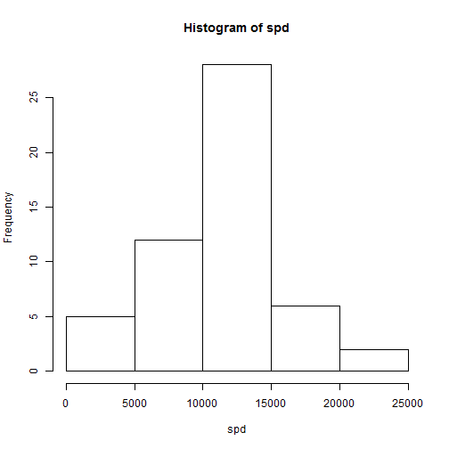
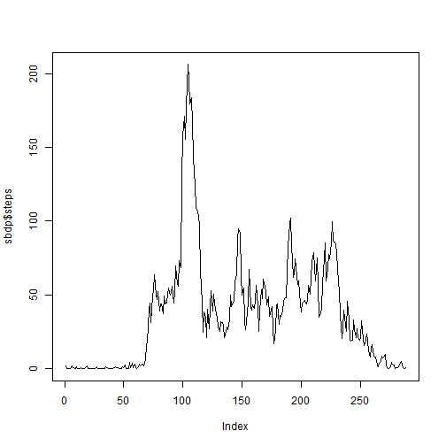
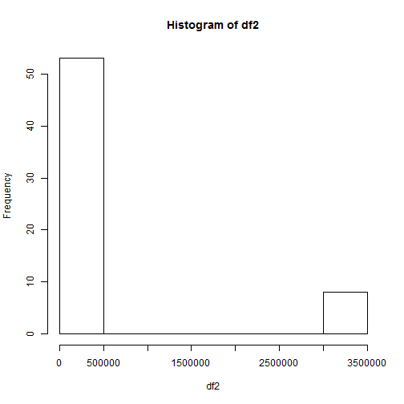
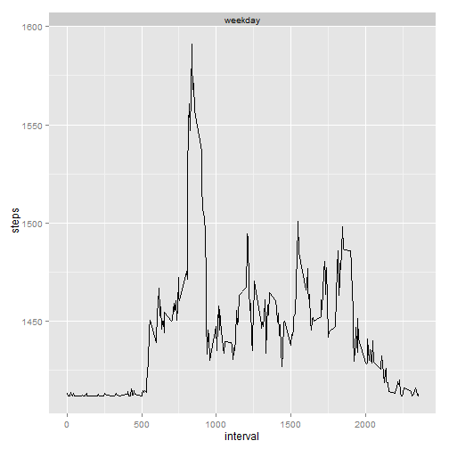

# Reproducible Research: Peer Assessment 1

## install the packages and loading the library

```r
install.packages("ggplot2")
```

```
## package 'ggplot2' successfully unpacked and MD5 sums checked
## 
## The downloaded binary packages are in
## 	C:\Users\HéctorManuel\AppData\Local\Temp\RtmpOWzu8N\downloaded_packages
```

```r
library(ggplot2)
```

## Loading the data

```r
wd <- getwd()
dd <- paste0(wd,"/RepData_PeerAssessment1")
dir.create(dd, recursive = FALSE)
setwd(dd)
download.file("https://d396qusza40orc.cloudfront.net/repdata%2Fdata%2Factivity.zip",paste0(dd,"/repdata-Fdata-Factivity.zip"))
unzip("repdata-Fdata-Factivity.zip")
##file.rename("repdata-Fdata-Factivity.zip", "activity.csv")
df <- read.csv("activity.csv")
df$date <- as.Date(df$date)
```

## omit Na values

```r
dfo <- na.omit(df)
```

# Q.1 What is mean total number of steps taken per day?
## making a histogram of the total number of steps taken each day

```r
spd <- aggregate(steps ~ date, data=dfo, sum)$steps
hist(spd)
```

 

## calculating the mean and median

```r
mean_spd <- mean(spd)
mean_spd
```

```
## [1] 10766.19
```

```r
median_spd <- median(spd)
median_spd
```

```
## [1] 10765
```

The mean total number of steps per day is 10766, and the median total number of steps per day is 10765.


# Q.2 What is the average daily activity pattern?
## creating and calculating the average daily activity pattern

```r
sbdp <- aggregate(steps ~ interval, data=df, FUN=mean)
plot(sbdp$steps, type = "l")
```

 

## finding the row of interval with highest mean steps

```r
max_sbdp = which.max(sbdp$steps)
max_sbdp
```

```
## [1] 104
```

The row of interval with highest mean steps is: 104

# Q.3 Imputing missing values
## calculating total number of missing values in the dataset

```r
df_na <- sum(is.na(df$steps))
```

Total number of missing values in the dataset: 2304

## creating a new dataset with the NA's filled with the mean

```r
df2 <- df
df2$steps[is.na(df2$steps)] <- mean_spd
```

I filled the NA values of the new dataset with the mean of the dataset created previously ignoring the missing values

## ploting the missing values filled with the mean

```r
df2 <- aggregate(steps ~ date, df2, sum)$steps
hist(df2)
```

 

```r
mean_df2 <- mean(df2)
median_df2 <- median(df2)
```

The mean total number of steps per day is 415998, and the median total number of steps per day is 11458.

# Q.4 Are there differences in activity patterns between weekdays and weekends?
## creating a new factor variable in the dataset with two levels - "weekday" and "weekend"

```r
df3 <- df
df3$steps[is.na(df3$steps)] <- mean_spd
df3$day[weekdays(as.Date(df3$date)) %in% c("Saturday", "Sunday")] <- "weekend"
df3$day[!weekdays(as.Date(df3$date)) %in% c("Saturday", "Sunday")] <- "weekday"
df3[, 4] <- as.factor(df3[, 4])
```

## creating a panel plot 

```r
sdf3 <- aggregate(steps ~ interval + day, data=df3, FUN=mean)
ggplot(sdf3, aes(x=interval, y=steps, group=1)) + geom_line() +facet_wrap(~ day, ncol=1)
```

 

I found differences in activity patterns between weekdays and weekends.
